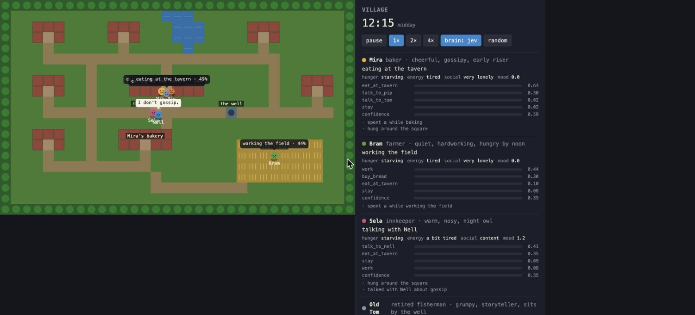

# Village

A tiny top-down world — six villagers, a tavern, a bakery, a well, a field — where the
people are driven by Jev. Watched from a browser. Code owns the world; Jev owns the
choices; an optional LLM owns the words.



Midday: Mira, Pip and Old Tom are eating at the tavern, Sela is telling Nell "I don't
gossip", and Bram — starving but hardworking — is torn between the field (44%) and
bread (30%) at confidence 0.39. Every bubble over a head is Jev's top choice and its
probability; the panel shows the whole distribution.

## How to run

```
uv run examples/village/server.py                      # open http://127.0.0.1:8765
uv run examples/village/server.py --narrator claude    # Claude writes the dialogue (needs ANTHROPIC_API_KEY in .env)
uv run examples/village/server.py --brain random       # no Jev: sanity-check the world itself
uv run examples/village/server.py --headless 120       # 120 sim-seconds, no browser, prints the event log
```

Controls in the page: pause, 1×/2×/4× speed, and a live switch between the Jev brain and
a random one — the fastest way to see what Jev adds. Needs `TYPESAFE_API_KEY` in `.env`.
The server keeps both API keys; the browser only receives world snapshots over a
WebSocket.

## Example response

Headless, 120 sim-seconds (about 8 game-hours), Jev brain, template narrator:

```
[10:33] Bram → buy_bread (0.44)
[10:33] Sela → talk_to_nell (0.58)
[10:33] Sela and Nell talk about gossip
[11:40] Bram → eat_at_tavern (0.70)
[11:40] Sela → eat_at_tavern (0.45)
[11:40] Nell → eat_at_tavern (0.57)
[12:19] Pip → eat_at_tavern (0.80)
[12:36] Mira → talk_to_sela (0.25)
[12:36] Mira and Sela talk about gossip
[13:45] Old Tom → talk_to_pip (0.26)
[13:46] Old Tom and Pip talk about old times
[14:47] Mira → go_home_rest (0.42)
[14:47] Bram → go_home_rest (0.32)

Mira     heading home to rest   needs={'hunger': 'peckish', 'energy': 'exhausted', 'social': 'content'}
         memory=['ate at the tavern', 'talked with Sela about gossip', 'talked with Bram about gossip']
Old Tom  talking with Pip       memory=['spent a while sitting by the well', 'ate at the tavern', 'talked with Pip about old times']
```

Nobody scripted "everyone goes to the tavern at noon", "the nosy innkeeper gossips", or
"the old storyteller corners the kid about the old days". Those fall out of traits and
needs described in words plus one Choice question per villager. Cost for that run: 23
requests, 47k input tokens, $0.002 — roughly 7¢ per real hour at 1× speed.

## How it works

```
sim/world.py     ASCII map → tiles, places, A* paths, the clock (a game day is 6 real minutes)
sim/npc.py       who they are (role, traits), how they feel (needs), what they remember (6 items),
                 what they're doing — and describe(): the villager as Jev sees them, in words
sim/actions.py   the bounded set of things anyone can do; each knows when it's available,
                 how to describe itself for Jev, what to do on arrival, what it changes
sim/brain.py     Brain protocol. JevBrain: one request per tick with one Choice per idle
                 villager (+ a mood Score and a speculative "what would they talk about").
                 RandomBrain: the fallback and the control group.
sim/narrator.py  Narrator protocol. TemplateNarrator: canned lines. ClaudeNarrator: the LLM seam.
sim/engine.py    the loop: movement, needs, arrivals, conversations, batching idle villagers
                 into a brain request without ever blocking the world on it
server.py        FastAPI + WebSocket; streams snapshots at 10 Hz; serves static/index.html
static/index.html  canvas renderer, thought bubbles, speech bubbles, the side panel
```

### What Jev sees

```json
{
  "time": "12:15, midday",
  "villagers": {
    "bram": {"role": "farmer", "traits": ["quiet", "hardworking", "hungry by noon"],
             "feels": {"hunger": "starving", "energy": "tired", "social": "very lonely"},
             "at": "the field", "doing": "working the field",
             "recently": ["spent a while working the field"]},
    "...": {}
  },
  "places": {"The Wet Boot": "warm, serves food and drink, open; Mira, Pip, Old Tom are here", "...": ""}
}
```

and one `Choice` per idle villager whose options are the *currently available* actions,
each described with distance in words ("Walk to The Wet Boot (a short walk away) for a
meal; warm, serves food and drink, open; Mira, Pip are here"). No coordinates, no
numbers, no paths: the jaggedness docs are explicit that Jev handles semantic
representations better than numeric ones, so needs are `"starving"` rather than `0.91`
and distance is `"across the village"` rather than `17`.

The request also carries a `Score` for mood (drawn on the face) and a speculative
`Choice` for conversation topic, which code only reads if that villager ends up
talking. Same request, no extra latency: the fan-out pattern.

### Where the LLM goes

Jev returns probabilities, not text, so it cannot write what Mira says to Bram. That is
the narrator's job, and it is the only place a generative model is called:

| decision | who | how often | latency tolerance |
|---|---|---|---|
| what does each villager do next | Jev | every few seconds, every villager | must be fast (~300 ms) |
| what mood are they in, what would they talk about | Jev | same request | free |
| the actual lines of a conversation | LLM (or templates) | a few times a minute, village-wide | a second is fine; bubbles are queued |

`--narrator claude` uses `claude-opus-5` at low effort for 2–4 short lines, given both
villagers' traits, feelings, and memories. The `Narrator` protocol is where later
generative behaviors plug in: a rumor that mutates as it passes from mouth to mouth, a
notice pinned to the square, a villager naming a new dish.

### Policy in code

Everything Jev doesn't decide is deterministic and tunable without touching a question:
need rates (`npc.py`), how long actions take and what they change (`actions.py`),
how many memories a villager keeps, when the tavern and bakery are open (`world.py`), how
far someone will chase a moving conversation partner before giving up (`engine.py`).
Traits are plain strings; add `"afraid of the well"` to Old Tom and watch the
`fetch_water` probability change without changing any code.

## Building on it

- **New behavior** = a new `Action` in `actions.py` (or a dynamic one like `talk_action`).
  It appears in Jev's options automatically wherever `available()` is true.
- **New villager** = one line in `default_cast()` plus a home tile on the map.
- **New judgment** = another question in `JevBrain._questions` (e.g. a Noul "would share
  the rumor they heard") and a field on `Decision`; read it in `Sim._apply`.
- **Reactions to the player** = add a player entity to `world.snapshot`/`describe()` and
  a `talk_to_player`/`avoid_player` action; the brain needs no change.
- **A different renderer** = anything that speaks the WebSocket snapshot; the sim
  doesn't know about the canvas.

## Things Jev taught us while building it

- **Roles and traits do a lot of work.** With identical needs, the farmer picks `work`
  at 0.89 and the night-owl innkeeper picks `go_to_square` at 0.22 (nothing is open yet,
  nobody is around, and she isn't a morning person). No per-villager prompt.
- **Low confidence is the interesting frame.** Bram at 0.39 between field and bread is the
  most human moment in the screenshot. Rounding it to a decision and hiding the
  distribution would throw that away.
- **The speculative topic must be shared.** Each side of a conversation had its own
  "what would I bring up"; the log said *gossip* and Bram remembered *the harvest*. Code
  now assigns one topic to both when the conversation starts.
- **The world has to keep moving while the model thinks.** Decisions are a background
  task; idle villagers stand still for ~300 ms with a "…" over their heads and the rest
  keep walking. A blocking call would have made the whole village stutter in lockstep.
