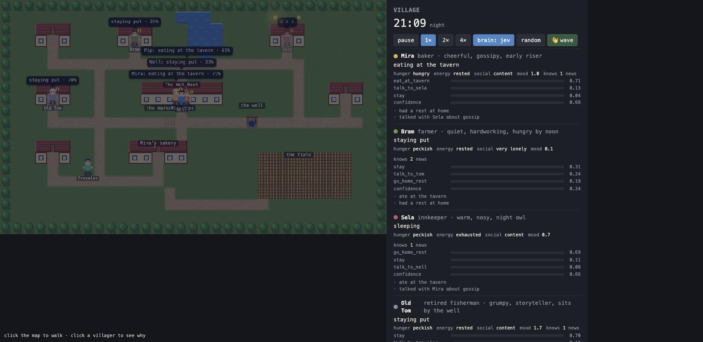
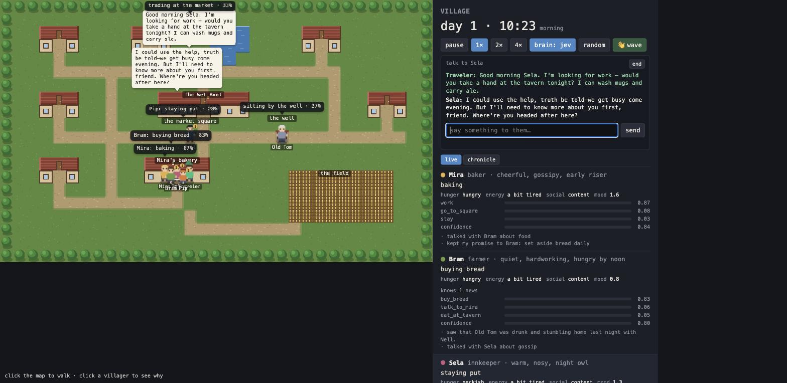
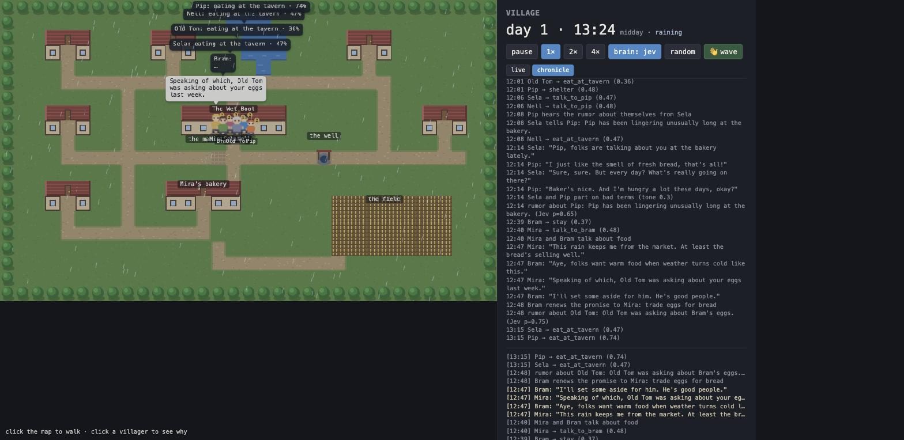
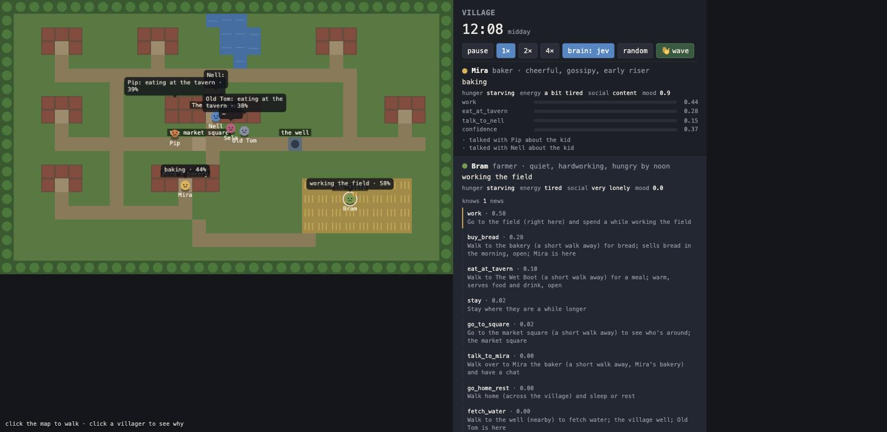

# Village

A tiny top-down world — six villagers, a tavern, a bakery, a well, a field — where the
people are driven by Jev. Watched from a browser. Code owns the world; Jev owns the
choices; an optional LLM owns the words.


Midday: Mira, Pip and Old Tom are eating at the tavern, Sela is telling Nell "I don't
gossip", and Bram — starving but hardworking — is torn between the field (44%) and
bread (30%) at confidence 0.39. Every bubble over a head is Jev's top choice and its
probability; the panel shows the whole distribution.



Night: Sela is asleep with her windows lit, the tavern crowd's thoughts stack without
overlapping, and Old Tom is 70% "staying put" because of course he is.



Talking to Sela. The traveler asked for work; Sela, being nosy, wants to know more first.
Jev read the reply and recorded *declined* (p=0.23) — no commitment yet.



The chronicle tab, day 1 around noon: a rumor about Pip that Sela heard from Nell, Pip
hearing it about himself, the confrontation Haiku wrote for it, and Jev judging the
exchange tense — which is now a grudge in Pip's relationships and a memory that
tonight's reflection will read.



Click a villager and the panel shows what Jev was actually asked: every available action
in the words it was described with — "Walk to the bakery (a short walk away) for bread;
sells bread in the morning, open; Mira is here" — and the probability it got.

## How to run

```
uv run examples/village/server.py                          # open http://127.0.0.1:8765
uv run examples/village/server.py --narrator template      # canned dialogue (default is Claude when ANTHROPIC_API_KEY is set)
uv run examples/village/server.py --narrator-model claude-sonnet-5   # bigger model for the dialogue
uv run examples/village/server.py --brain random           # no Jev: sanity-check the world itself
uv run examples/village/server.py --headless 120           # 120 sim-seconds, no browser, prints the event log
```

In the page:

- **Click the map** to walk. You are the traveler (green, pointed hat). Villagers see
  "a traveler passing through, new to the village" in their state and may come greet you.
- **👋 wave** — nearby villagers remember "the traveler waved at me".
- **Click a villager** (on the map or in the panel) to see *why*: every option Jev was
  offered, in the exact words it was given, with its probability; their memory; what news
  they've heard; who they get along with.
- **Talk to them.** With a villager selected, type in the chat box: the traveler walks
  over, the villager replies in character, and Jev decides what your words did (below).
- pause · 1×/2×/4× · a live **jev ↔ random** brain switch, the fastest way to see what
  Jev adds.

Needs `TYPESAFE_API_KEY` in `.env`; `ANTHROPIC_API_KEY` turns on Claude dialogue
(`claude-haiku-4-5` by default — short in-character lines are a small job, and Haiku
answers in about a second). The server keeps both keys; the browser only receives world
snapshots over a WebSocket.

## Example response

Headless, 120 sim-seconds (about 8 game-hours), Jev brain, template narrator:

```
[10:33] Bram → buy_bread (0.44)
[10:33] Sela → talk_to_nell (0.58)
[10:33] Sela and Nell talk about gossip
[11:40] Bram → eat_at_tavern (0.70)
[11:40] Sela → eat_at_tavern (0.45)
[11:40] Nell → eat_at_tavern (0.57)
[12:19] Pip → eat_at_tavern (0.80)
[12:36] Mira → talk_to_sela (0.25)
[12:36] Mira and Sela talk about gossip
[13:45] Old Tom → talk_to_pip (0.26)
[13:46] Old Tom and Pip talk about old times
[14:47] Mira → go_home_rest (0.42)
[14:47] Bram → go_home_rest (0.32)

Mira     heading home to rest   needs={'hunger': 'peckish', 'energy': 'exhausted', 'social': 'content'}
         memory=['ate at the tavern', 'talked with Sela about gossip', 'talked with Bram about gossip']
Old Tom  talking with Pip       memory=['spent a while sitting by the well', 'ate at the tavern', 'talked with Pip about old times']
```

Nobody scripted "everyone goes to the tavern at noon", "the nosy innkeeper gossips", or
"the old storyteller corners the kid about the old days". Those fall out of traits and
needs described in words plus one Choice question per villager. Cost for that run: 23
requests, 47k input tokens, $0.002 — roughly 7¢ per real hour at 1× speed.

## Talking to villagers

Select a villager and type. The traveler walks over (the villager waits), Haiku writes the
reply from the villager's full state — traits, mood, memories, what they've heard, how they
feel about you, your earlier exchanges — and then **Jev reads both your message and the
reply** and decides what happened:

| Jev question | what it changes |
|---|---|
| how did the villager take it (Score: badly / neutral / well) | their affinity toward you, their mood |
| was the traveler rude or threatening (Noul) | affinity down, "the traveler was rude to me" in long-term memory |
| did you assert a claim, and does *this* villager believe it (Nouls) | believed → it enters their knowledge as news (with a subject if it names someone) and can spread; doubted → "the traveler claimed…; I'm not sure I believe it" |
| did you ask them to do something, and did they agree (Nouls) | agreed → a commitment to you with a deadline, kept or broken like any other |

The LLM proposes the structured reading (claim, request, agreed) in the same call that
writes the reply; Jev verifies it against the actual text and judges belief given who the
villager is. So the same rumor lands differently: gossipy Sela may run with it, wary Bram
won't. That is the influence model — your words have consequences, but through each
character's own judgment, and everything you say is in their journal.

The chat ends when you walk away, press *end*, or say nothing for 30 sim-seconds; the
villager remembers the conversation and goes back to their day.

## What happens in the village (v3: memory, consequence, change)

- **Villagers know only what they've seen.** Each one sees within 7 tiles or the place
  they're in, and remembers where they last saw everyone. Jev gets *their* view: "Bram —
  last seen at the field around 09:40". They go looking where they believe someone is and
  sometimes find nobody: "went looking for Old Tom on the road but he wasn't there" — which
  Pip later brings up in conversation.
- **Conversations have consequences.** The narrator writes the lines and may propose a
  promise or a piece of gossip; nothing is applied until **Jev reads the lines** and
  confirms it (was the promise really made? is the rumor about that person's conduct? how
  did the exchange go?). Confirmed promises become **commitments** with a deadline that
  the promiser sees as a `keep_promise` option; kept promises raise affinity, broken ones
  lower it and become news ("Nell doesn't keep her word"). A tense exchange lowers
  affinity and both remember it. Rumors carry a subject; when the subject hears one about
  themselves, they take it badly and hold it against the messenger.
- **Incidents need someone to step up.** A fire at the bakery (three water carriers
  needed), Pip missing, Old Tom ill, a thief at the market. Whoever knows gets a job
  action; a speculative Noul shows who *would* drop everything. Helpers are remembered
  gratefully; those who knew and didn't come are not.
- **Memory has layers.** `recently` (short, what Jev sees every decision), a **journal**
  (everything, forever, with day and time), and **long-term memory** for significant
  events — being helped in a fire, a broken promise, a rumor about you — which Jev sees as
  `remembers_well` on every decision for the rest of the run.
- **Characters change.** When a villager goes to sleep, Jev reads their day and their
  long-term memories and picks the strongest change: more wary / trusting / sociable /
  withdrawn / bitter / generous / anxious / easygoing, or unchanged. Code applies it to
  their traits (evolved traits show in gold), which every future decision sees. After a
  day with a fire, a broken promise, and gossip: Bram became *wary of others* (p=0.98),
  Nell too; Mira, who was helped, became *trusting*; Sela *generous*; Pip and Old Tom had
  ordinary days.
- **The chronicle** is the full linear history with day markers, in its own tab; each
  villager's card shows their commitments, long-term memories, how they've changed, whom
  they last saw where, and their journal.

## What happens in the village (v2)

- **Needs** (hunger, energy, social) rise over time and are described to Jev in words;
  actions bring them down. Around noon everyone drifts to the tavern; at night they go home
  and the windows light up.
- **Weather.** Rain starts and stops. The field is "muddy in the rain", a `shelter` action
  appears, and villagers remember "it started raining".
- **News.** Every minute or two something happens — the well rope snaps, a fox gets into
  the henhouse, a boat is seen on the river — and whoever is at the right place sees it.
  When two villagers talk, a speculative Jev `Noul` ("would they pass on what they've
  heard?") decides whether the news spreads; the listener learns it and remembers who told
  them. The **news · who knows** panel and the gold badge on each villager show the
  propagation. Gossipy villagers spread news; quiet ones sit on it.
- **Relationships.** Each conversation adds affinity; friends appear in the state as
  "gets along with", so pairs that have talked tend to seek each other out again.
- **You.** The traveler is an NPC with no brain and no needs. Villagers get a
  `talk_to_traveler` option when you're close ("a stranger new to the village"), and Claude
  writes the greeting when one of them comes over.

## How it works

```
sim/world.py     ASCII map → tiles, places, A* paths, the clock (a game day is 6 real minutes)
sim/npc.py       who they are (role, traits), how they feel (needs), what they remember (6 items),
                 what they're doing — and describe(): the villager as Jev sees them, in words
sim/actions.py   the bounded set of things anyone can do; each knows when it's available,
                 how to describe itself for Jev, what to do on arrival, what it changes
sim/brain.py     Brain protocol. JevBrain: one request per tick with one Choice per idle
                 villager (+ a mood Score and a speculative "what would they talk about").
                 RandomBrain: the fallback and the control group.
sim/narrator.py  Narrator protocol. TemplateNarrator: canned lines. ClaudeNarrator: the LLM seam.
sim/incidents.py things that go wrong and need a helper: spawn, job actions, resolve/fail effects
sim/outcomes.py  the LLM proposes a promise/rumor (or, for the player, a claim/request), Jev
                 verifies against the lines and judges belief/agreement, code applies
sim/reflection.py nightly: Jev judges how the day changed a villager; code drifts their traits
sim/engine.py    the loop: movement, needs, perception, arrivals, conversations, incidents,
                 commitments, decisions — never blocking the world on a model
server.py        FastAPI + WebSocket; streams snapshots at 10 Hz; serves static/index.html
static/index.html  canvas renderer: pre-rendered tile layer, procedural pixel sprites with walk
                 cycles and facing, snapshot interpolation, non-overlapping bubble layout, the side panel
```

### What Jev sees

```json
{
  "time": "12:15, midday",
  "villagers": {
    "bram": {"role": "farmer", "traits": ["quiet", "hardworking", "hungry by noon"],
             "feels": {"hunger": "starving", "energy": "tired", "social": "very lonely"},
             "at": "the field", "doing": "working the field",
             "recently": ["spent a while working the field"]},
    "...": {}
  },
  "places": {"The Wet Boot": "warm, serves food and drink, open; Mira, Pip, Old Tom are here", "...": ""}
}
```

and one `Choice` per idle villager whose options are the *currently available* actions,
each described with distance in words ("Walk to The Wet Boot (a short walk away) for a
meal; warm, serves food and drink, open; Mira, Pip are here"). No coordinates, no
numbers, no paths: the jaggedness docs are explicit that Jev handles semantic
representations better than numeric ones, so needs are `"starving"` rather than `0.91`
and distance is `"across the village"` rather than `17`.

The request also carries a `Score` for mood (drawn on the face) and a speculative
`Choice` for conversation topic, which code only reads if that villager ends up
talking. Same request, no extra latency: the fan-out pattern.

### Where the LLM goes

Jev returns probabilities, not text, so it cannot write what Mira says to Bram. That is
the narrator's job, and it is the only place a generative model is called:

| decision | who | how often | latency tolerance |
|---|---|---|---|
| what does each villager do next | Jev | every few seconds, every villager | must be fast (~300 ms) |
| what mood are they in, what would they talk about | Jev | same request | free |
| the actual lines of a conversation | LLM (or templates) | a few times a minute, village-wide | a second is fine; bubbles are queued |

With `ANTHROPIC_API_KEY` set, the narrator uses `claude-haiku-4-5` for 2–4 short lines,
given both villagers' traits, feelings, memories, the weather, and the topic (or the news
being passed on). Haiku answers in about a second at roughly $0.0006 per conversation;
`--narrator-model` swaps in a bigger model when the writing matters more than latency. The `Narrator` protocol is where later
generative behaviors plug in: a rumor that mutates as it passes from mouth to mouth, a
notice pinned to the square, a villager naming a new dish.

### Policy in code

Everything Jev doesn't decide is deterministic and tunable without touching a question:
need rates (`npc.py`), how long actions take and what they change (`actions.py`),
how many memories a villager keeps, when the tavern and bakery are open (`world.py`), how
far someone will chase a moving conversation partner before giving up (`engine.py`).
Traits are plain strings; add `"afraid of the well"` to Old Tom and watch the
`fetch_water` probability change without changing any code.

## Things Jev taught us while building it (round four: talking to villagers)

- **Belief is a judgment about the listener, not the claim.** The same sentence about
  Old Tom's hidden boat is *believed* or *doubted* depending on the villager's traits and
  opinion of the traveler; Jev gets both in state and the reply text as evidence. Sela at
  0.42 ("that's interesting…") stayed below the line — right call.
- **A hedge is not a yes.** "Come by tonight and we'll see how you work out" was judged
  *declined* for a request to be hired; the request-agreement Noul's false criterion
  ("asks for something first") is doing exactly that.
- **LLM replies come with stage directions.** `*leans against the counter*` had to be
  stripped and prohibited; the outcome JSON still parsed fine.

## Things Jev taught us while building it (round three)

- **Generation confabulates; verification is cheap.** Haiku proposed a rumor "about She"
  and one about "unknown thief"; Jev's Noul plus a name lookup dropped both. The pattern
  (LLM proposes structured content → Jev confirms it against the source text → code
  applies) is the extraction-cascade cookbook, and it is what makes it safe to let the
  narrator invent things.
- **A promise made in conversation should be keepable in conversation.** Bram kept coming
  back — "got that bread and cider you promised?" — and Mira kept re-promising, because
  fulfilment only existed as a separate action. Now Jev is also asked whether a standing
  promise between the two speakers was *carried out* in the exchange, and a repeat promise
  renews the deadline instead of creating a duplicate.
- **"About someone" needs a boundary.** "Her henhouse was attacked by a fox" is an event
  that happened to Mira, not gossip about her. The rumor criterion now says conduct or
  character, and gives both kinds as examples.
- **Incidents need cooldowns and office hours.** Without them the bakery burned four times
  in a day, once at 1 am while everyone slept.

## Things Jev taught us while building it (round two)

- **Actions must live on the villager, not in a shared registry.** Caching `talk_to_pip`
  globally offered it to everyone, including Pip. "Pip talking with Pip" was the symptom.
- **A speculative answer is per-villager; a conversation is shared.** Same lesson as the
  topic, now for news: the *speaker's* `share_news` decides, and both sides record the same
  outcome.
- **A slow narrator must not outlive the conversation.** Opus took ~5 s; the queued lines
  ran past the 14 s conversation window. The conversation now extends to cover its lines,
  and Haiku made the problem mostly moot.
- **Re-rendering a panel 10×/s eats clicks.** `mousedown` on a node that is replaced before
  `mouseup` never becomes a `click`. Delegated `pointerdown` on the container fixed it, and
  the canvas uses `pointerdown` too.

## Rendering notes

No engine, no dependencies: one `<canvas>` and ~400 lines. Choices that made it look like
a game rather than a diagram:

- **Interpolate, don't ease.** The server broadcasts at 10 Hz. Easing toward the latest
  position lurches; rendering one snapshot behind and lerping between the last two is
  smooth at 60 fps at the cost of 100 ms of latency nobody notices.
- **Pre-render the map once** to an offscreen canvas (textured grass, path edges, gabled
  roofs with windows and doors, trees with shadows, wheat rows). Per frame only water
  shimmer, sprites, bubbles, and light are drawn.
- **Procedural pixel sprites.** A 12×16 character template with palette keys (hair, skin,
  tunic, pants, boots, hat) rendered per villager and cached; two leg frames for the walk
  cycle, horizontal flip for facing, painter's order by y so nearer villagers overlap
  farther ones.
- **Bubbles are laid out, not just drawn.** Every bubble is collected first, then placed
  greedily (speech before thoughts, left to right); one that would overlap a placed bubble
  or a place label is pushed above it, and villagers who share a spot get their name
  prefixed.
- **Light.** Dusk and dawn tint warm, night tints blue; a sleeping villager's windows glow.

When this wants real art, the step up is a 2D engine (PixiJS or Phaser) with a proper
tileset and sprite sheets, not a 3D one; three.js only makes sense if the village goes
isometric or 3D, which is an art decision more than a rendering one. The simulation
doesn't care: anything that reads the WebSocket snapshot can render it.

## Building on it

- **New behavior** = a new `Action` in `actions.py` (or a dynamic one like `talk_action`).
  It appears in Jev's options automatically wherever `available()` is true.
- **New villager** = one line in `default_cast()` plus a home tile on the map.
- **New judgment** = another question in `JevBrain._questions` (e.g. a Noul "would share
  the rumor they heard") and a field on `Decision`; read it in `Sim._apply`.
- **Reactions to the player** = add a player entity to `world.snapshot`/`describe()` and
  a `talk_to_player`/`avoid_player` action; the brain needs no change.
- **A different renderer** = anything that speaks the WebSocket snapshot; the sim
  doesn't know about the canvas.

## Things Jev taught us while building it

- **Roles and traits do a lot of work.** With identical needs, the farmer picks `work`
  at 0.89 and the night-owl innkeeper picks `go_to_square` at 0.22 (nothing is open yet,
  nobody is around, and she isn't a morning person). No per-villager prompt.
- **Low confidence is the interesting frame.** Bram at 0.39 between field and bread is the
  most human moment in the screenshot. Rounding it to a decision and hiding the
  distribution would throw that away.
- **The speculative topic must be shared.** Each side of a conversation had its own
  "what would I bring up"; the log said *gossip* and Bram remembered *the harvest*. Code
  now assigns one topic to both when the conversation starts.
- **The world has to keep moving while the model thinks.** Decisions are a background
  task; idle villagers stand still for ~300 ms with a "…" over their heads and the rest
  keep walking. A blocking call would have made the whole village stutter in lockstep.
